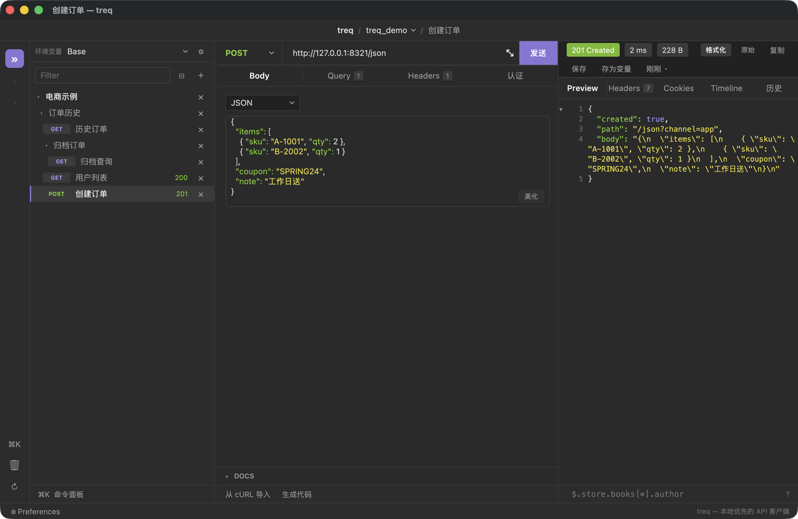
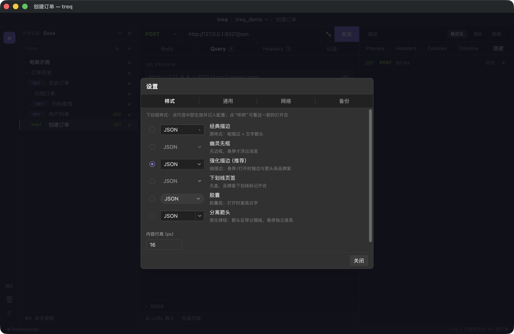

# treq

> 本地优先的桌面 API 客户端 —— 界面与交互参考 **Insomnia**，Rust + GPUI 原生实现。接口全部存成可读、可 diff、可进 Git 的 YAML 文件。
>
> A local-first desktop API client (Insomnia-style UX) written in Rust + GPUI. No account, no cloud sync, no telemetry — your workspace is just a folder of YAML files.



<p align="center"><sub>多层分组 · JSON 语法着色与折叠 · 状态码/耗时/大小 · 行号 · JSON 路径提示</sub></p>

## 这是什么

一个自己每天在用的接口调试工具：左边是空间 → 集合 → 分组（可任意层级）→ 请求的树，中间是请求编辑器，右边是响应。不同的是**数据形态**：不是黑盒数据库，而是你磁盘上一堆 `.yml`，能用 Git 管、能用脚本批量生成、能直接改。

这个项目（含界面、核心逻辑、测试、这份 README）绝大部分代码由 AI 编程助手（Claude Code / pi）编写，人负责提需求、试用来回打磨、拍板取舍。仓库里 228 个测试用例和每次改动后的截图自检，就是让它敢连续重构的前提。

## 特性

**请求**
- 方法（GET/POST/PUT/PATCH/DELETE/HEAD/OPTIONS）+ URL 预览（变量解析 + 参数拼接后的最终 URL）
- Query / Headers / Body（JSON、文本、表单、multipart、二进制文件）/ 认证 / 内联 Docs 五个 tab，表格支持拖拽排序、批量增删
- 认证：无 / Bearer（可自定义前缀）/ Basic / API Key（Header 或 Query），token 支持 `{{ 变量 }}`；**手写了同名头就以手写为准**
- JSON body 编辑器：自动增高 + 语法高亮，**行高可调**（设置 → 样式，12–32px）。
  这一个值管的是 JSON/正文内容：请求体 JSON、Docs、响应正文、响应头与
  Cookies/Timeline 列表——所以「接口返回值的 JSON」和「请求体 JSON」永远一样密；
  Query/Headers 这类表格是固定高度的组件，不跟着变
- 事件流（SSE）：逐段渲染，收到响应头后不限时，可开「到达时间」列；「停止」≤1 秒生效
- `⌘Enter` 发送 / 停止

**响应**
- 格式化（JSON 语法着色）/ 原始、行号、底部过滤框（只显示命中的行）、**JSON 行首箭头折叠**（`{`/`[` 行点 ▸ 折叠，工具栏「折叠全部 / 展开全部」只折最外层，折了带 `…` 标记）、大响应护栏（超 2MB 折叠，「完整」开关可强制全量渲染，接收上限 64MB）
- 切到别的请求再切回来，**上次的响应还在**（每个请求各存一份，最多 16 条 / 32MB，超出丢最旧的）；中途切走的慢请求也照记历史
- Headers / Cookies / Timeline / 历史 四个 tab；Cookies 直接显示解析后的属性与过期时间
- 一键**复制正文**、**保存到文件**（按 content-type 猜扩展名，中文名保留）
- 正文行右键：**复制这一行 / 复制这一行的值 / 复制它的 JSON 路径 / 存为变量…**

**组织与查找**
- 空间（工作区）→ 集合 → 分组 → 请求 四级树，**分组可嵌套任意层**；折叠全部、重命名、移动、回收站
- 请求右键：生成代码 / 复制 URL / 复制为 cURL / 复制为新请求 / **移动到…**（可打字的集合·分组选择器）/ 重命名 / 删除
- 集合右键：新建请求 / **新建分组** / 新建集合 / 导入 cURL / 导入文件 / 折叠其它 / 重命名 / 删除
- `⌘K` 命令面板：跨工作区搜接口名/URL/方法，命中后自动展开并滚动定位
- 前进 / 后退（`⌘[` `⌘]` 或 `⌥←` `⌥→`），会话恢复：每个工作区记住最后打开的请求

**环境与变量**
- base 环境 + 多个覆盖环境，模板语法 `{{ name }}`（URL、参数、头、body、认证里都能用）
- **变量面板**：「环境 ▾ → 变量」，列出合并后的变量、敏感名默认打码（可切换显示明文）、当前请求缺哪些变量可一键「补进环境」
- 请求条上会橙色提醒未定义变量 —— 这类变量过去会被原样发出去

**网络**
- 代理（Clash / Surge 这类；不写协议自动补 `http://`），空值即直连
- 单请求超时可配（默认 30s，上限 600s）；语义是「连接 + 等响应头」，事件流收到头之后不再限时
- Cookie 罐：解析 `Set-Cookie`（域匹配防 `evilexample.com` 命中 `example.com`、路径边界、`Secure`、`Max-Age`），落盘持久化，发送时注入；自己手写的 `Cookie` 头优先

**导入 / 导出**
- 从 cURL 导入（`-X/-H/-d/--json/-u` 等）
- 从文件导入：**Postman v2.x 集合**、**OpenAPI 3**（JSON 或 YAML，含 tag 分组、security → 认证、body 骨架）、**HAR 1.2**（按域名分组）
- 代码生成 15 种目标（cURL、Java OkHttp、Python requests、Go、JS fetch…），生成的代码里包含认证设置
- 备份 / 恢复：合并或覆盖恢复，覆盖前自动留现场备份

**其它**
- 中英双语（界面文案全部走 `i18n.rs` 的 zh/en 双分支，有测试强制两边键一致）
- 自动备份：默认**一天一份、保留 10 份**（工作区同级 `<工作区名>-backups/`），间隔与份数在设置 → 备份里改
- 下拉框 6 种视觉样式可选（设置 → 样式，选中即生效）
- 所有纵向滚动区都有滚动条（自绘，不拦点击）
- 快捷键：`⌘K`/`⌃K` 命令面板、`⌘Enter`/`⌘R` 发送（重发）、`⌘F` 聚焦响应过滤框、`⌘D` 复制为新请求、`⌘[` `⌘]`（或 `⌥←` `⌥→`）前进后退、`⌘,` 偏好菜单、`Esc` 关弹层

<p align="center"></p>
<p align="center"><sub>设置：下拉样式预览、内容行高、通用 / 网络 / 备份</sub></p>

## 快速开始

需要 macOS（GPUI 的窗口后端目前只在 macOS 上跑）。

```bash
git clone <本仓库> && cd treq
cargo run -p treq-app                     # 开发运行（debug）
./scripts/bundle.sh release               # 打成 .app → target/treq.app
open target/treq.app
```

首次启动会把工作区定在 `~/Documents/treq`（可在左上角工作区切换里改）。目录长这样：

```
~/Documents/treq/
├── collections/
│   └── <集合 id>/
│       ├── collection.yml            # 集合元数据（名字）
│       ├── requests/<请求 id>.yml    # 集合根下的请求
│       └── groups/<分组 id>/
│           ├── group.yml             # 分组元数据（名字 + parent: 上级分组 id）
│           └── requests/<请求 id>.yml
└── environments/
    ├── base.yml                      # 基础环境（所有环境共有）
    └── <环境 id>.yml                 # 各环境覆盖项
```

> 分组在盘上是**平铺**的，层级只记在 `group.yml` 的 `parent` 字段里 —— 所以新建/删除/移动分组不需要搬目录，任意层级也不会让路径变深。`parent` 指向不存在的分组（手改过、或回收站只还原子分组）时会当成第一层，不会消失。

请求就是一个 YAML 文件，手写、脚本生成、进版本库都没问题：

```yaml
name: 查订单
method: GET
url: '{{ baseUrl }}/orders/{{ orderId }}'
params:
  - { key: verbose, value: 'true', enabled: true, description: '' }
headers:
  - { key: X-Tenant, value: '{{ tenant }}', enabled: true, description: '' }
body: { kind: none, content: '', form_data: [] }
auth:
  kind: bearer
  token: '{{ token }}'
  prefix: ''
```

> 两处坑：`url` 里带 `{{ 变量 }}` 时**要加引号**，否则 YAML 会把它当 flow mapping 解析（启动日志会提示跳过该文件）；手工编辑时只有 `id/name/method/url` 是必需的，缺 `enabled` 之类字段会按默认值补上，解析不了的单个文件会被跳过并在日志里说明（不会静默丢数据）。

## 应用数据

| 内容 | 位置 |
|---|---|
| 设置（工作区列表、语言、下拉样式、内容行高、代理、超时、上次打开的请求） | `~/Library/Application Support/com.treq.app/settings.toml` |
| Cookie 罐 | 同上目录 `cookies.json` |
| 发送历史（SQLite） | 同上目录 `history.db` |
| 回收站 | 同上目录 `trash/` |
| 自动备份 | 工作区同级 `<工作区名>-backups/`（默认每天一份、保留 10 份） |

## 仓库结构

```
crates/
├── treq-core/          # 不依赖 UI 的全部逻辑（可单独当库用）
│   ├── models.rs       # 领域模型（RequestItem/Collection/Group/Environment/Body/Kv…）
│   ├── store.rs        # 工作区读写 + 路径索引
│   ├── http.rs         # 发送（普通 + 事件流）、代理、超时、DNS/TLS 细节
│   ├── vars.rs         # {{ 变量 }} 解析、合并环境、未定义变量检测
│   ├── auth.rs         # 认证方式与注入规则
│   ├── cookies.rs      # Cookie 罐（解析/匹配/落盘格式）
│   ├── curl.rs         # cURL 命令 → 请求
│   ├── import.rs       # Postman / OpenAPI / HAR → 集合
│   ├── trash.rs        # 回收站（请求/分组/集合）
│   ├── backup.rs       # 备份 / 恢复（系统 zip）+ 保留策略
│   ├── codegen.rs      # 代码生成
│   ├── history.rs      # 发送历史（SQLite）
│   ├── json.rs         # JSON 高亮/格式化
│   ├── legacy_import.rs# Insomnium / Yaak 迁移（一次性）
│   └── regroup.rs      # 按服务 / 域名重组集合（**只留骨架，实现留空**）
└── treq-app/           # GPUI 桌面端
    ├── main.rs         # 窗口、菜单栏、快捷键
    ├── model.rs        # AppModel：状态与动作入口
    │   └── model/      # 按主题拆出的 14 个子模块（send/response_ui/request_edit/backup/…）
    ├── panes.rs        # 请求区 / 响应区 / 状态栏骨架
    │   └── panes/      # 视图子模块（tree/editor/editor_kv/editor_auth/response/popup）
    ├── dialogs.rs      # 各类弹层（备份、导入、网络、Cookie、变量、环境编辑…）
    ├── theme.rs        # 唯一配色/尺寸真源（φ 间距阶梯）
    ├── i18n.rs         # 中英文案
    ├── widgets.rs      # 通用控件（按钮、输入框、弹层、自绘滚动条）
    ├── jsonview.rs     # 大响应分行与缓存
    ├── syntax.rs       # 轻量 JSON/语法着色
    ├── fold.rs         # JSON 折叠模型
    ├── nav.rs          # 前进/后退栈
    ├── search.rs       # 侧栏树摊平 + 命令面板搜索（纯逻辑 + 测试）
    └── files.rs        # 保存文件名推断（纯逻辑 + 测试）
scripts/
├── bundle.sh           # 打包 .app（含图标）
├── mock_server.py      # 本地假接口：/json /echo /status/N /delay /big /sse /cookies /auth
└── sse_demo_server.py  # 纯标准库 SSE 演示（可控延迟/事件数）
```

## 开发

```bash
cargo test --workspace        # 228 个用例（core 纯逻辑 + http/curl/store/codegen/import 集成）
cargo clippy --workspace --all-targets
cargo fmt --all

python3 scripts/mock_server.py    # 本地 mock 服务：127.0.0.1:8321
```

约定：

- 颜色、尺寸、间距**只**从 `theme.rs` 取，间距走 φ 阶梯（3/5/8/13/21/34）；不允许裸像素和直写色值
- 界面文案必须同时补 `i18n.rs` 的 zh / en 两个分支
- 能抽成纯函数就抽成纯函数并配单测（树摊平、行高夹取、滚动条几何、备份策略都是这么测的）
- 带 `#[test]` 的纯逻辑放在不 `use gpui::*` 的模块里（gpui 会 glob 导出 `test` 宏，撞上就是 `#[test]` 自递归）
- 改 UI 后用「按窗口 ID 截图 + 像素测量」自检，别靠肉眼估位置
- core 侧对外的错误信息用中文；app 侧的错误提示走 i18n

## 一次性迁移/重组工具

`legacy_import.rs`（Insomnium / Yaak → treq）与 `regroup.rs`（按服务/域名重组集合）
都是一次性工具。其中 `regroup()` 的**实现留空**：当初那套「哪个域名算同一个服务」的
规则完全取决于个人环境，不适合分发，仓库里只留接口（`split_url` 可直接复用）和
`examples/regroup_services.rs` 的调用示例，需要的话照注释自己实现。

## License

MIT（见 `Cargo.toml` 的 `license` 字段；仓库暂未放 LICENSE 文件）。
